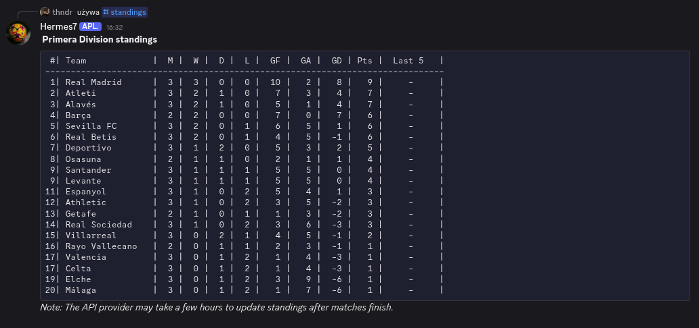
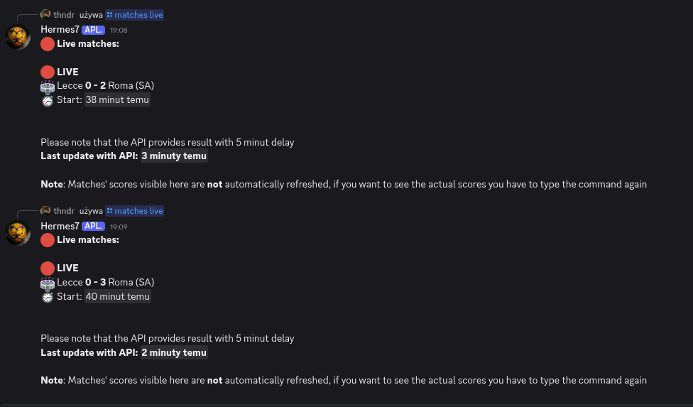
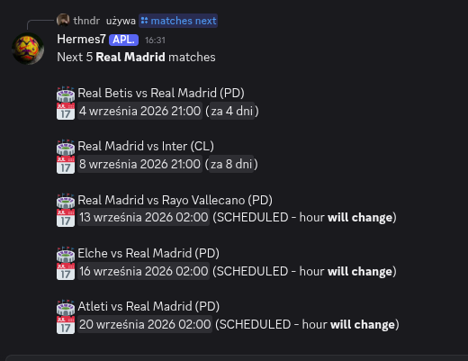
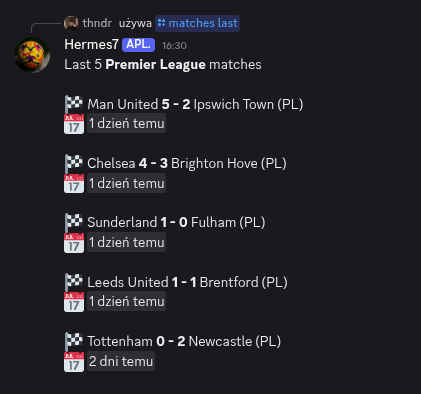
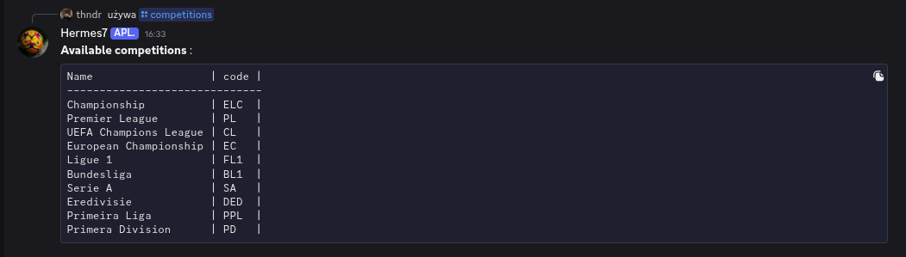

# Football match tracker (Discord bot)
Made by a football fan for football fans.

## Tech stack:
- Java 21
- Maven 
- Spring Boot
- PostgreSQL
- football-data.org
- junit & mockito for tests

## Known limitations
- Some competitions, including EURO, World Cup and Champions League, may provide incomplete or delayed data depending on the external API.

## Features: 
- **/matches live** - Displays currently live matches
- **/matches next** - Displays next matches for team or comp or matches for today if no argument given
- **/matches last** - Displays last matches for team or comp or matches ended in last 24h if no argument given
- **/competitions** - Displays list of available competitions
- **/standings**    - Displays standings for given competition
- **/teams**        - Displays teams for given competition

## How it works
Bot serves data from PostgreSQL rather than querying external API for every request. The database is periodically synchronized with football-data.org according to the type of data.
I've also added a custom **rate limiter** for obeying the api's rate limits

Data fetching uses adaptive polling. The bot checks every minute whether any match should currently be live based on database data. 
If so, it fetches the relevant competitions to minimize live score delays while respecting API rate limits.

The bot runs 24/7 as a system service on an old laptop.

## Plans for the future
- Subscription-based notifications for users when team that they follow is playing
- more fun commands

## Gallery

  <h3>/standings</h3>
  
    
  <h3>/matches live</h3>
  
    
  <h3>/matches next</h3>
  
    
  <h3>/matches last</h3>
  
    
  <h3>/competitions</h3>
  
  

